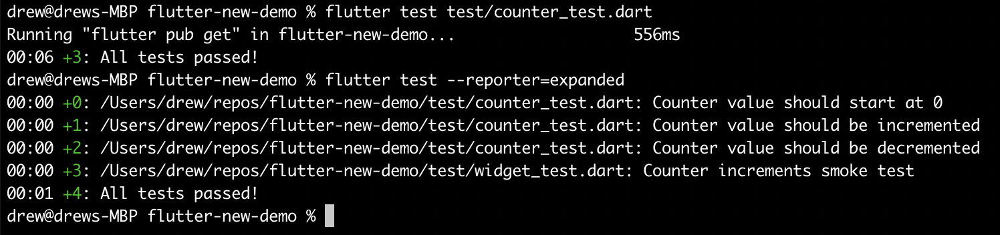

# Flutter demo

A simple flutter application with tests.

## Specific tests
Run a specific group of tests from a file:

`flutter test test/counter_test.dart`

## All tests
Run all tests:

`flutter test`

## Tests - Expanded
Runs tests, but shows one on each line:

`flutter test --reporter=expanded`

